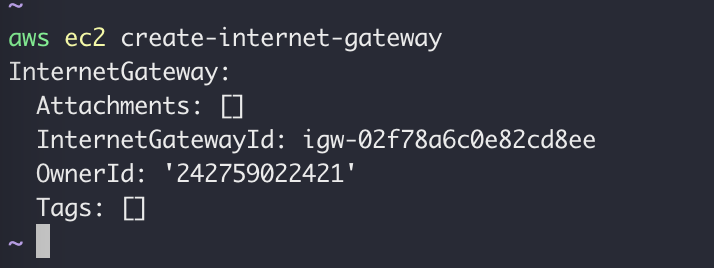

<Callout>
  이 글에서는 aws cli 설치 및 설정이 되어있다고 가정하고 진행합니다.
</Callout>

## VPC 생성

<ModCodeBlock
  template="
  aws ec2 create-vpc --cidr-block {{cidr-block}}"
  data={{
    "cidr-block": "10.10.0.0/16",
  }}
/>


위 명령어로 VPC를 생성하면 위와 VPC 정보가 반환됩니다.

## Subnet 생성

<ModCodeBlock
  template="
    aws ec2 create-subnet --vpc-id {{vpc-id}} \
    --cidr-block {{cidr-block}}"
  data={{
    "vpc-id": "vpc-067f7fb23d3dfd42e",
    "cidr-block": "10.10.0.0/24",
  }}
/>


서브넷을 생성하면 위와 같이 서브넷 정보가 반환됩니다.

## IGW 생성

```
aws ec2 create-internet-gateway
```



인터넷 게이트웨이를 생성하고 반환되는 아이디를 메모해 둡니다.

<ModCodeBlock
  template="
    aws ec2 attach-internet-gateway --internet-gateway-id {{igw-id}} \
    --vpc-id {{vpc-id}}"
  data={{
    "igw-id": "igw-02f78a6c0e82cd8ee",
    "vpc-id": "vpc-067f7fb23d3dfd42e",
  }}
/>

이제 인터넷 게이트웨이를 VPC에 연결합니다.


2번 실행해서 `already attached to network` 라는 메시지가 나오면 성공입니다.

## Route Table 생성

<ModCodeBlock
  template="
    aws ec2 create-route-table --vpc-id {{vpc-id}}"
  data={{
    "vpc-id": "vpc-067f7fb23d3dfd42e",
  }}
/>


다음 명령어로 Route table을 생성합니다.

<ModCodeBlock
  template="
    aws ec2 create-route --route-table-id {{route-table-id}} \
    --destination-cidr-block {{destination-cidr-block}} \
    --gateway-id {{gateway-id}}"
  data={{
    "route-table-id": "rtb-053e6e74ab1744ab0",
    "destination-cidr-block": "0.0.0.0/0",
    "gateway-id": "igw-02f78a6c0e82cd8ee",
  }}
/>


결과값 `Ture`가 반환 됩니다.

이제 Route table에 서브넷을 연결해 보겠습니다.

<ModCodeBlock
  template='
    aws ec2 describe-subnets --filters "Name=vpc-id,Values={{vpc-id}}" \
    --query "Subnets[*].{ID:SubnetId,CIDR:CidrBlock}"'
  data={{
    "vpc-id": "vpc-067f7fb23d3dfd42e",
  }}
/>


서브넷의 아이디는 다음 명령어로 확인할 수 있습니다.

<ModCodeBlock
  template="
    aws ec2 associate-route-table --subnet-id {{subnet-id}} \
    --route-table-id {{route-table-id}}"
  data={{
    "subnet-id": "subnet-05fb90e4ff9120ef7",
    "route-table-id": "rtb-053e6e74ab1744ab0",
  }}
/>


서브넷을 Route table에 연결합니다.

<ModCodeBlock
  template="
    aws ec2 modify-subnet-attribute --subnet-id {{subnet-id}} \
    --map-public-ip-on-launch"
  data={{
    "subnet-id": "subnet-05fb90e4ff9120ef7",
  }}
/>

다음 명령어를 통해, EC2 공용 IP 주소를 자동으로 할당하도록 설정합니다.  
EC2 인스턴스의 경우 재시작 하면 IP 주소가 변경 되기 때문에, 반드시 설정 해야합니다.  
그게 아니면, 탄력적 IP 주소를 인스턴스와 연결해야 합니다.

## SG 생성

<ModCodeBlock
  template="
    aws ec2 create-security-group --group-name {{group-name}} \
    --description {{description}} \
    --vpc-id {{vpc-id}}"
  data={{
    "group-name": "cli-security-group",
    description: "cli-security-group",
    "vpc-id": "vpc-067f7fb23d3dfd42e",
  }}
/>


다음 명령어로 보안그룹을 생성합니다.

<ModCodeBlock
  template="
    aws ec2 authorize-security-group-ingress --group-id {{group-id}} \
    --protocol {{protocol}} \
    --port {{port}} \
    --cidr {{cidr}}"
  data={{
    "group-id": "sg-0626016b0d2a61414",
    protocol: "tcp",
    port: "22",
    cidr: "0.0.0.0/0",
  }}
/>


이어서 보안그룹 22포트(ssh)를 어디서나 들어올 수 있게 `0.0.0.0/0`으로 뚫어줍니다.

## key pair 생성

<ModCodeBlock
  template="
    aws ec2 create-key-pair --key-name {{key-name}} \
    --query 'KeyMaterial' --output text > {{key-name}}.pem
    
    chmod 400 {{key-name}}.pem"
  data={{
    "key-name": "clikeypair",
  }}
/>

키 페어를 생성하고, 권한을 줍니다.

## EC2 생성

```
aws ec2 describe-images --owners self amazon | less
```

다음 명령어로 AMI를 찾을 수 있습니다. 적당한 AMI를 선택합니다.

<ModCodeBlock
  template="
    aws ec2 run-instances --image-id {{image-id}} \
    --count 1 \
    --instance-type t2.micro \
    --key-name {{key-name}} \
    --security-group-ids {{security-group-ids}} \
    --subnet-id {{subnet-id}}"
  data={{
    "image-id": "ami-0cb01c18bcde8e856",
    "key-name": "clikeypair",
    "security-group-ids": "sg-0626016b0d2a61414",
    "subnet-id": "subnet-05fb90e4ff9120ef7",
  }}
/>

다음 명령어로 EC2 인스턴스를 생성합니다.


인스턴스 생성시 출력되는 인스턴스 아이디를 메모해 둡니다.

<ModCodeBlock
  template="
    aws ec2 describe-instances --instance-id {{instance-id}}"
  data={{
    "instance-id": "i-09ed4ffc4dcae9a05",
  }}
/>


위 명령어로 인스턴스의 상태가 running가 될 때 까지 기다립니다.

<ModCodeBlock
  template="
    aws ec2 describe-instances --instance-id {{instance-id}} \
    --query 'Reservations[*].Instances[*].PublicIpAddress' \
    --output text"
  data={{
    "instance-id": "i-09ed4ffc4dcae9a05",
  }}
/>


위에 명령으로 EC2 인스턴스의 퍼블릭 IP를 확인합니다.

<ModCodeBlock
  template="
    ssh -i {{key-name}}.pem ec2-user@{{public-ip}}"
  data={{
    "key-name": "clikeypair",
    "public-ip": "34.239.114.18",
  }}
/>

조금 전 만들어뒀던 키와 EC2 아이피를 입력해서 ssh 접속을 시도합니다.


그럼 성공적으로 CLI에서 EC2 인스턴스로 접속한 것을 볼 수 있습니다.

<ModCodeBlock
  template="
    aws ec2 terminate-instances --instance-ids {{instance-id}}
    aws ec2 delete-subnet --subnet-id {{subnet-id}}
    aws ec2 delete-route-table --route-table-id {{route-table-id}}
    aws ec2 detach-internet-gateway --internet-gateway-id {{igw-id}} --vpc-id {{vpc-id}}
    aws ec2 delete-internet-gateway --internet-gateway-id {{igw-id}}
    aws ec2 delete-security-group --group-id {{group-id}}
    aws ec2 delete-vpc --vpc-id {{vpc-id}}"
  data={{
    "instance-id": "i-09ed4ffc4dcae9a05",
    "subnet-id": "subnet-05fb90e4ff9120ef7",
    "route-table-id": "rtb-053e6e74ab1744ab0",
    "igw-id": "igw-02f78a6c0e82cd8ee",
    "vpc-id": "vpc-067f7fb23d3dfd42e",
    "group-id": "sg-0626016b0d2a61414",
  }}
/>

EC2 인스턴스 및 보안그룹 삭제는 다음 순서로 삭제할 수 있습니다.
한번에 입력하면 삭제되지 않을 수 있으니 하나씩 입력해주세요.

- EC2 인스턴스 삭제
- 서브넷 삭제
- Route table 삭제
- 인터넷 게이트웨이를 VPC에서 분리
- 인터넷 게이트웨이 삭제
- 보안그룹 삭제
- VPC 삭제

_더 좋은 방법으로는 [nuke](https://chltjdbs.tistory.com/31)를 이용하여 전부 삭제하는 방법도 있습니다._

---

ref: https://dev.classmethod.jp/articles/build-ec2-with-aws-cli/
