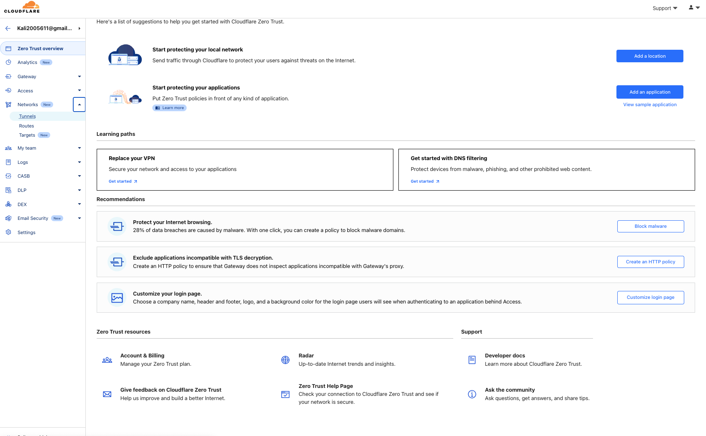

### Introduction

When starting a homelab or reconfiguring an existing setup, simplicity and flexibility are key.  
This post introduces a practical solution that can adapt to environments ranging from small setups like Raspberry Pi to Proxmox-based infrastructures.

Here, we’ll cover how to expose your homelab to the internet without complex network configurations, port forwarding, SSL certificate issuance, or a static IP.

"All you need are two things: the internet and Docker."

By using Cloudflare Tunnel, you can securely connect your projects to the internet without needing network permissions.  
This provides reliable access with SSL applied, all without using DDNS or port forwarding. By connecting Cloudflare Tunnel with Traefik, we can achieve all this functionality.

Let’s dive into the specifics!

### Running Traefik with Docker Compose

Let’s start with a Docker Compose file that launches two containers.

```yaml
services:
  traefik:
    image: "traefik:v3.2"
    command:
      - "--api.insecure=true"
      - "--providers.docker=true"
      - "--providers.docker.exposedbydefault=false"
      - "--entryPoints.web.address=:80"
    ports:
      - "80:80"
      - "8080:8080"
    volumes:
      - "/var/run/docker.sock:/var/run/docker.sock:ro"

  iplogger:
    image: "ghcr.io/minpeter/iplogger"
    labels:
      - "traefik.enable=true"
      - "traefik.http.routers.iplogger.rule=Host(`ip.local`)"
      - "traefik.http.routers.iplogger.entrypoints=web"
```

Copy the content above into a file named `docker-compose.yaml`. Run `docker compose up` in the directory containing this file to complete the preparation for the first test.

At this point, we’ve achieved two things:

1. We’ve launched the “minpeter/iplogger” container, the service to be hosted in this post. It’s a simple container that returns user information when accessed.
2. We’ve set up the Traefik container and configured its dashboard. To verify visually, visit [http://localhost:8080](http://localhost:8080).

These two containers are now connected. To test this, try the following command:

```sh
curl -H "Host:ip.local" localhost:80
```

You should see a response like this:

```
Your IP is: 192.168.100.1
Hostname: 5e1dbc2a6fe2
IP: 127.0.0.1
IP: ::1
IP: 192.168.100.3
RemoteAddr: 192.168.100.2:41938
GET / HTTP/1.1
Accept-Encoding: gzip
Accept: */*
User-Agent: curl/8.7.1
X-Forwarded-For: 192.168.100.1
X-Forwarded-Host: ip.tmpf.me
X-Forwarded-Port: 80
X-Forwarded-Proto: http
X-Forwarded-Server: 81638c02bba0
X-Real-Ip: 192.168.100.1
```

This indicates that a request was sent to the Traefik container and accessed with the hostname `ip.local`.

\*The hostname is automatically added when connecting to a service using the HTTP protocol. For this example, it was manually set as we accessed [localhost:80](http://localhost:80).

Now we’ve implemented a Traefik proxy and added one service behind it.

Next, we’ll expose this setup to the public internet using a Cloudflare Tunnel.

### Exposing Traefik Proxy to the Public Internet with Cloudflare Tunnel

First, you’ll need a Cloudflare account. The tunnel feature is free, except for some advanced functions, so there’s no need to worry about costs.

You’ll also need a domain connected to Cloudflare. Let’s proceed under the assumption that this is already configured.

Log in to [https://dash.cloudflare.com](https://dash.cloudflare.com), and look for the “Zero Trust” menu on the left. Click it, and you’ll see the following screen:



Continue to the “Networks > Tunnels” menu.


Click the blue “Add a tunnel” button, and the following screen will appear.


For this example, we’ll use the Cloudflared container, so select “Select Cloudflared.”

On the next page, choose any name you like, then click “Save tunnel” to create the tunnel.


On the next screen, select Docker. You’ll see a command box starting with `docker run...`. Copy the value after `--token`, which looks like “eyJhI…”.

Now, you have the token to access the Cloudflare Tunnel.

Next, modify the previously created `docker-compose.yaml` file as shown below:

```yaml
services:
  traefik:
    image: "traefik:v3.2"
    command:
      - "--api.insecure=true"
      - "--providers.docker=true"
      - "--providers.docker.exposedbydefault=false"
      - "--entryPoints.web.address=:80"
    ports:
      - "80:80"
      - "8080:8080"
    volumes:
      - "/var/run/docker.sock:/var/run/docker.sock:ro"

  iplogger:
    image: ghcr.io/minpeter/iplogger
    labels:
      - "traefik.enable=true"
      - "traefik.http.routers.iplogger.rule=Host(`ip.example.com`)"  // [!code ++]
      - "traefik.http.routers.iplogger.entrypoints=web"

  cloudflared:                              // [!code ++]
    image: "cloudflare/cloudflared:latest"  // [!code ++]
    command: "tunnel --no-autoupdate run"   // [!code ++]
    environment:                            // [!code ++]
      - "TUNNEL_TOKEN=${TUNNEL_TOKEN}"      // [!code ++]
```

Stop the previous `docker compose up` command by pressing `Ctrl+C`, then run the following:

```
TUNNEL_TOKEN="YOUR_CLOUDFLARE_TUNNEL_TOKEN (e.g. eyJhI...)" docker compose up
```

This will launch the Cloudflared, Traefik, and IpLogger containers.


If no errors appear in the terminal, return to the Cloudflare Zero Trust console.


A new connection has been created. Click “Next.”


Configure the settings as shown below:

\*Replace `tmpf.me` with your own domain.

```
Subdomain: *
Domain: example.com
Path: (none)
Service Type: HTTP
Service URL: traefik
```

Most of the setup is now complete. Click “Save Tunnel,” and you’ll see the following screen:


Copy the Tunnel ID. Now for the final step!

Exit the Cloudflare Zero Trust console, go to the domain dashboard for your domain (e.g., tmpf.me), and navigate to “DNS > Records.”

Add a record as follows:

```
Type: CNAME
Name: *
Target: <Tunnel ID>.cfargotunnel.com
Proxy status: ON
```


Now it’s truly complete.

All the annoying configurations like SSL, port forwarding, and DDNS are done.

Is it really done? Let’s check by accessing “https://ip.example.com” (adjusted in the compose.yaml file).

Congratulations! You’ve now built a personal reverse proxy that’s independent of your internet environment.

### Limitations and Potential Improvements

1. “X-Forwarded-For” headers are not properly forwarded. However, you can use headers like “Cf-Connecting-Ip” as a replacement.
2. Wildcard subdomains under the root domain, like “\_.example.com,” are not supported. This is because Cloudflare doesn’t issue certificates for them, and there’s no solution other than paying for it.
3. There might be a maximum bandwidth limit. For example, Cloudflare proxy features have a 100MB limit for the free tier.
4. Tunnels can forward not just HTTP but also HTTPS and TCP connections. For instance, you could use them for sharing database connections.

This is undoubtedly a fascinating feature. Now, go explore further possibilities yourself!
